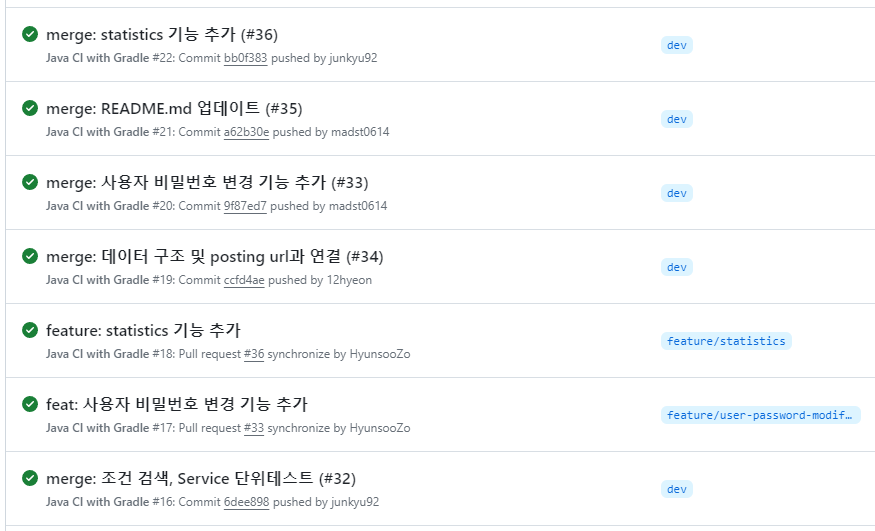

# 소셜 미디어 통합 Feed 서비스

## 팀 소개
<div align="center">

|  |  |  |  |  
|------------------------------------------------------------------------------------------------------------------|-----------------------------------------------------------------------------------------------------------------|-------------------------------------------------------------------------------------------------------------------------------------------|-----------------------------------------------------------------------------------------------------------------|  
| Back-End (팀장)                                                                                                    | Back-End                                                                                                        | Back-End                                                                                                                                  | Back-End                                                                                                        |                                                                                                 |
| [이준규](https://github.com/junkyu92)                                                                               | [이현정](https://github.com/12hyeon)                                                                               | [최승호](https://github.com/madst0614)                                                                                                    | [조현수](https://github.com/HyunsooZo)                                                                            |

</div>

## 목차
- [개요](#개요)
- [프로젝트 관리 및 일정](#프로젝트-관리-및-일정)
- [사용기술](#사용기술)
- [API 문서](#API-문서)
- [구현 기능](#구현기능)
- [시스템 구성도](#시스템-구성도)
- [ERD](#ERD)
- [TIL 및 회고](#프로젝트-관리-및-회고)


## 개요

본 서비스는 유저 계정의 해시태그(`#kim_wanted`) 를 기반으로 `Instagram`, `Thread`, `Facebook`, `Twitter`등 <br>
복수의 SNS에 게시된 게시물 중 유저의 해시태그가 포함된 게시물들을 하나의 서비스에서 확인할 수 있는  <br>
통합 Feed 어플리케이션 입니다. 이를 통해 본 서비스의 고객은 하나의 채널로 유저(`#kim_wanted`) <br>
또는 브랜드(`#nike`) 의 SNS 노출 게시물 및 통계를 확인할 수 있습니다.
<br/>


## 프로젝트 관리 및 일정
[-%23000000.svg?style=for-the-badge&logo=notion&logoColor=white)](https://invited-town-199.notion.site/Team-N-8eb74edcabc246b2b4aa37b72c5d0707?p=251cafd32bf14284a54d95a0cff54b9b&pm=c)


## 사용기술

#### 개발환경
   
<br>
     
<br>
 
<br>
  

#### 배포환경
<image src="https://img.shields.io/badge/Docker-2496ED?&logo=Docker&logoColor=white">   
<br>
 

#### 협업도구
 
<br/>

## API 문서
[-85EA2D?&logo=swagger&logoColor=white)](http://54.225.40.161:8090/swagger-ui/index.html#/)


| API Type | Http Method| URL                         | Description    |
|----------|-------------|-----------------------------|----------------|
| **Auth API** | POST | `/api/v1/auth/refresh`                   | 엑세스토큰 재발급      | 
| **User API**| POST | `/api/v1/users/sign-up`                  | 회원가입           |
| **User API**| PATCH | `/api/v1/users/verification`             | 회원가입 인증        |
| **User API**| POST | `/api/v1/users/verification/otp-reissue` | OTP 재발급        |
| **User API**| POST | `/api/v1/users/sign-in`                  | 로그인            |
| **User API**| PATCH | `/api/v1/users/password/modify`          | 비밀번호 변경        |
| **User API**| PATCH | `/api/v1/users/password/reset`           | 비밀번호 재설정       |
| **User API**| POST | `/api/v1/users/sign-out`                 | 로그아웃           |
| **Posting API**| GET | `/api/v1/postings`                       | 조건 검색          |
| **Posting API**| GET | `/api/v1/postings/{id}`                  | 포스팅 상세 가져오기    |
| **Posting API**| PATCH | `/api/v1/postings/like/{id}`             | 포스팅 좋아요        |
| **Posting API**| PATCH | `/api/v1/postings/share/{id}`            | 포스팅 공유         |
| **Log API**| GET | `/api/v1/logs/hashtags`                  | hot hashtag 조회 |


## 구현기능

<details>
  <summary>CI 구축</summary>

- **구현 기능** <br>
    - Github Actions를 통해 PR생성시 빌드, 테스트 자동화

- **구현 방법**<br>
    ```
    name: Java CI with Gradle

    #main, dev 브랜치에 push, pull_request시 작동
    on:
    push:
    branches:
    - main
      - dev
      pull_request:
      branches:
      - main
      - dev
    
    jobs:
    build:
    runs-on: ubuntu-latest
    #체크아웃 & secrets에 등록해놓은 설정파일을 빌드시 사용할 수 있게 복사
    steps:
    - uses: actions/checkout@v3
      - run: mkdir ./src/main/resources
      - run: touch ./src/main/resources/application.yml
      - run: echo "${{secrets.APPLICATION}}" > ./src/main/resources/application.yml
    
          - name: Set up JDK 11
            uses: actions/setup-java@v3
            with:
              java-version: '11'
              distribution: 'temurin'
            
              #gradle빌드 권한
          - name: Make gradlew executable
            run: chmod +x ./gradlew
          
              #빌드
          - name: Build with Gradle
            uses: gradle/gradle-build-action@bd5760595778326ba7f1441bcf7e88b49de61a25 # v2.6.0
            with:
              arguments: build
    
              #빌드 실패 시 comment등록, pr closed
              #if: ${{ failure() }} 를 사용하면 직전 스크립트가 실패 시 작동한다.
          - name: If build fail
            if: ${{ failure() }}
            uses: actions/github-script@v6
            with:
              github-token: ${{ github.token }}
              script: |
                const pull_number = ${{ github.event.pull_request.number }}
                const updated_title = `[BUILD FAIL] ${{ github.event.pull_request.title }}`
                await github.rest.pulls.createReview({
                  owner: context.repo.owner,
                  repo: context.repo.repo,
                  pull_number: pull_number,
                  body: '빌드에 실패했습니다.',
                  event: 'REQUEST_CHANGES'
                })
                await github.rest.pulls.update({
                  owner: context.repo.owner,
                  repo: context.repo.repo,
                  pull_number: pull_number,
                  title: updated_title,
                  state: 'closed'
                })
    ```
</details>

<details>
  <summary>CI 작동 확인</summary>


</details>

<details>
  <summary>Webhook</summary>

- **구현 기능** <br>
    - Github push시 Webhook작동

- **구현 방법**<br>
  
</details>

<details>
  <summary>CD 구축</summary>

- **구현 기능** <br>
    - Jenkins에서 Webhook을 받아서 main branch일 경우 배포

- **구현 방법**<br>
    - generic webhook trigger 플러그인 사용

      

    - 위 설정을 통해 main branch일 경우 pipeline script 실행

      

      

</details>

<details>
  <summary>CD 작동확인</summary>


</details>

## 시스템 구성도


## ERD


## TIL 및 회고
- 이번 프로젝트에서는 CI/CD Pipeline 구축을 담당했다. 
AWS에 직접 배포는 많이 해봤지만 Jenkins, Docker, Git Action 등 처음 사용해 본 기술이 많아서 얻어가는 것이 많았던 프로젝트였다.
코드를 작성하는 것보다는 새로 공부해야 할 내용도 많고 에러도 많이 나서 시간은 오래 걸렸지만 
그동안 대충 어떤 개념인지만 알고 있던 CI/CD를 직접 구축해보니 자동 배포의 흐름과 개념에 대해 확실하게 정립되었다. 

<details>
  <summary>ISSUE: EC2 디스크 부족</summary>

- 젠킨스 파이프라인 구성 후 젠킨스가 작동을 안하는 현상이 발생했다.
- 원인
  - 젠킨스 파이프라인에서 빌드의 반복으로 도커 이미지 빌드시 생성되는 임시파일들이 누적되어 용량부족
- 해결 방법
  - 도커 이미지 빌드시 생성되는 임시파일들을 삭제하는 명령어
  - sudo docker system prune -a -f
  - 해당 명령어를 pipeline에 넣어서 배포할 때마다 이전 임시파일들을 삭제하도록 했다.

</details>

<details>
  <summary>ISSUE: WEBHOOK 미작동</summary>

- 젠킨스에서 Generic Webhook Trigger 플러그인을 사용할 때 json에서 데이터를 받아서 사용하도록 설정을 했는데 
웹 훅이 제대로 작동하지 않았다.
- 원인
  - Generic Webhook Trigger 플러그인에서 pull_request.merged가 true일 때 작동하도록 설정했는데 Github Webhook
  Log를 확인해보니 해당 부분을 찾을 수 없었다.
  - 

- 해결 방법
  - 깃허브 웹훅 설정에서 pull request를 제거하고 main브랜치에 push될 때만 작동하도록 설정을 변경하였다.
  - 깃허브 로그에서 보내는 json을 확인하여 변수설정 수정 (push -> webhook -> main branch일 경우 배포)
  - 
</details>

